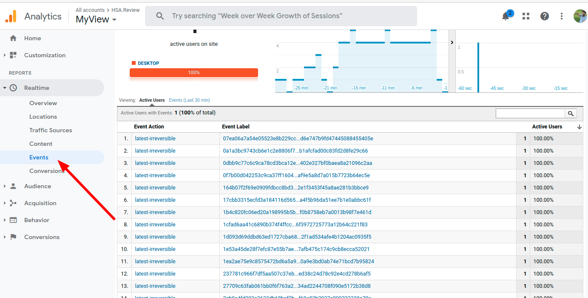

# HSA-hw3
Fetch the data about the last irreversible transaction on WAX and push it to the Google analytics.

Documentation for GAMP [here](https://developers.google.com/analytics/devguides/collection/protocol/v1/reference?hl=ru#required) and [here](https://support.google.com/analytics/answer/9539598)
And here you can find youtube lesson how to create analytics app [video link](https://youtu.be/TeZccPtzjRU)

P.S. When ypou will create app, push button "Hide advanced options" and select "Create a Universal analytics property"

P.S.S. Event we push we can find in block Realtime > Events

## Installation
pip install requests

## Run
python3 main.py
